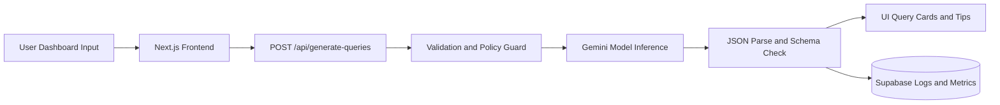

# Architecture and Data Flow

## Objective

The Job Search Optimization Agent converts user intent into platform-specific Boolean and X-Ray queries for six job platforms while keeping responses structured, auditable, and safe.

## Current Stack Alignment

- Frontend: Next.js + React
- API layer: Next.js Route Handler
- AI provider: Google Gemini API
- Storage and analytics: Supabase (proposed integration)
- Deployment: Vercel

## Request Lifecycle

1. User submits role, skills, location, experience, and exclusions.
2. Frontend calls POST /api/generate-queries.
3. API validates required fields and policy constraints.
4. API sends structured prompt to model.
5. Model returns structured JSON.
6. API parses and validates JSON shape.
7. Frontend renders per-platform query cards and tips.
8. Usage telemetry is recorded (proposed for next iteration).

## Security and Governance Controls

- Secrets stored in environment variables only.
- Input validation at API boundary.
- Strict JSON output parsing before response release.
- Request IDs and audit logs for traceability (next iteration).
- Minimal context design to reduce unnecessary data exposure.

## Mermaid Flow

## Next Iteration Upgrades

- Platform-specific strategy variants: strict, balanced, broad.
- Explanation fields per platform for transparency.
- Feedback loop: useful or not useful signals.
- Admin analytics endpoint for model quality tracking.
