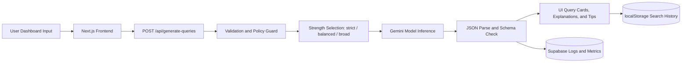

# Architecture and Data Flow

## Objective

The Job Search Optimization Agent converts user intent into platform-specific Boolean and X-Ray queries for six job platforms while keeping responses structured, auditable, and safe.

## Current Stack Alignment

- Frontend: Next.js + React
- API layer: Next.js Route Handler
- AI provider: Google Gemini API
- Storage and analytics: Supabase (proposed integration)
- Deployment: Vercel

## Request Lifecycle

1. User submits role, skills, location, experience, exclusions, and query strength.
2. Frontend calls POST /api/generate-queries with form data and strength selection.
3. API validates required fields and policy constraints.
4. API selects the appropriate strength instruction (strict, balanced, or broad).
5. API sends structured prompt to model requesting queries and per-platform explanations.
6. Model returns structured JSON with queries, explanations, and tips.
7. API parses and validates JSON shape.
8. Frontend renders per-platform query cards with copy, open-in-Google, and explanation panels.
9. Result is persisted to localStorage search history (up to 20 entries).
10. Usage telemetry is recorded (proposed for next iteration).

## Security and Governance Controls

- Secrets stored in environment variables only.
- Input validation at API boundary.
- Strict JSON output parsing before response release.
- Request IDs and audit logs for traceability (next iteration).
- Minimal context design to reduce unnecessary data exposure.

## Mermaid Flow

## Next Iteration Upgrades

- Feedback loop: useful or not useful signals per query.
- Admin analytics endpoint for model quality tracking.
- Saved query templates for repeat job seekers.
- Server-side search history via Supabase for cross-device persistence.
